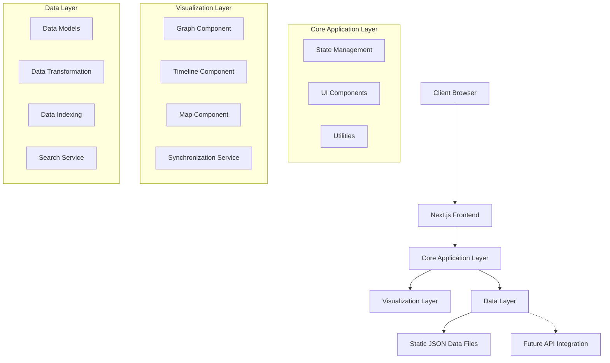
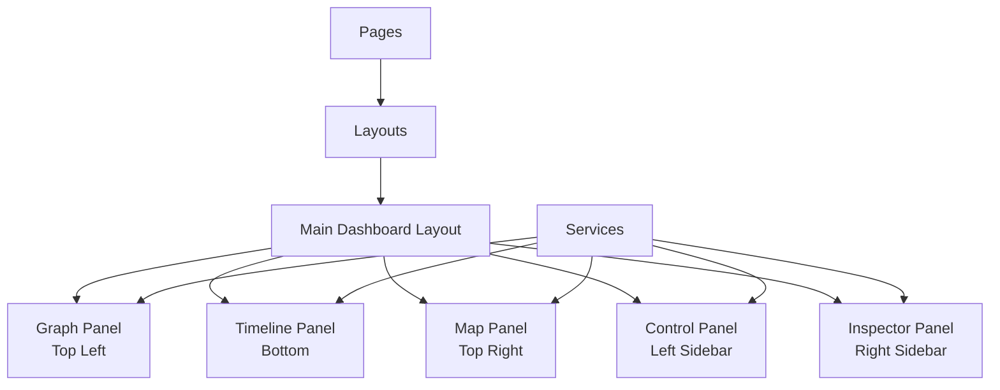
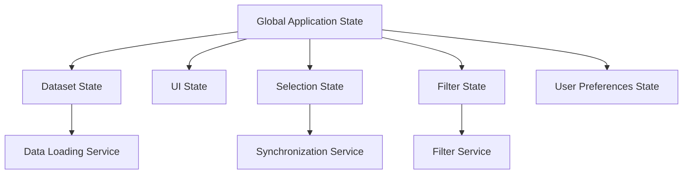

# Technical Architecture Document

## Executive Summary

This document outlines the technical architecture for the Kindi Intelligence Analysis Platform, a web-based application designed to help intelligence analysts visualize and interact with complex datasets across multiple dimensions. The architecture focuses on creating a performant, maintainable system that can handle large datasets while providing a responsive user experience.

The application will be built as a client-side Next.js application with TypeScript, using static JSON data files initially, with an architecture that supports future backend integration. The system emphasizes synchronized visualizations across graph, timeline, and map components, with careful attention to state management and performance optimization.

## Change Log

| Date | Version | Description | Author |
|------|---------|-------------|--------|
| 2023-06-17 | 0.1 | Initial architecture document | Architect |

## Technology Stack

### Core Technologies

- **Framework**: Next.js 15.5.0 with React 19.1.0
- **Language**: TypeScript 5.x
- **Styling**: Tailwind CSS 4.x
- **Build Tools**: Turbopack (via Next.js)
- **Package Manager**: npm

### Visualization Libraries

- **Network Graph**: react-force-graph (3D force-directed graph)
- **Timeline**: vis-timeline (interactive timeline visualization)
- **Map**: react-leaflet (interactive maps with Leaflet)

### Development Tools

- **Linting**: ESLint 9.x
- **Formatting**: Prettier
- **Testing**: Jest, React Testing Library, Playwright for E2E
- **State Management**: React Context API with custom hooks

## System Architecture

### High-Level Architecture



### Component Architecture

The application follows a component-based architecture with clear separation of concerns, organized around the three-panel dashboard layout with Graph (Top Left), Timeline (Bottom), and Map (Top Right) visualizations:

1. **Core Components**: Reusable UI elements that form the building blocks of the interface
2. **Container Components**: Manage state and data flow for specific sections of the application
3. **Page Components**: Represent complete pages or major application views
4. **Layout Components**: Handle the overall structure and responsive behavior, including the main dashboard layout
5. **Visualization Components**: Specialized components for data visualization (Graph, Timeline, Map)
6. **Panel Components**: Control Panel (Left Sidebar) and Inspector Panel (Right Sidebar)
7. **Service Components**: Handle cross-cutting concerns like data fetching and transformation



### Directory Structure

```
kindi-prototype/
├── app/                     # Next.js app directory
│   ├── api/                 # API routes (for future backend integration)
│   ├── components/          # Shared React components
│   │   ├── core/            # Core UI components
│   │   ├── layout/          # Layout components
│   │   └── visualizations/  # Visualization-specific components
│   ├── contexts/            # React context providers
│   ├── hooks/               # Custom React hooks
│   ├── lib/                 # Utility functions and services
│   │   ├── data/            # Data transformation and indexing
│   │   ├── search/          # Search functionality
│   │   └── sync/            # Synchronization between visualizations
│   ├── models/              # TypeScript interfaces and type definitions
│   ├── page.tsx             # Main application page
│   └── layout.tsx           # Root layout
├── data/                    # Static JSON data files
├── public/                  # Static assets
├── styles/                  # Global styles and Tailwind config
├── tests/                   # Test files
│   ├── unit/                # Unit tests
│   ├── integration/         # Integration tests
│   └── e2e/                 # End-to-end tests
└── utils/                   # Shared utility functions
```

## Data Architecture

### Data Models

The data model is designed to represent entities, relationships, events, and locations in a format that can be efficiently processed by all visualization components. The core data models are:

#### Entity

```typescript
interface Entity {
  id: string;
  type: EntityType;
  name: string;
  attributes: Record<string, any>;
  risk?: number;
  metadata?: Record<string, any>;
}

enum EntityType {
  PERSON = 'person',
  ORGANIZATION = 'organization',
  OBJECT = 'object',
  LOCATION = 'location',
  DIGITAL = 'digital',
  CUSTOM = 'custom'
}
```

#### Relationship

```typescript
interface Relationship {
  id: string;
  type: RelationshipType;
  source: string; // Entity ID
  target: string; // Entity ID
  directed: boolean;
  strength?: number;
  startTime?: string; // ISO date string
  endTime?: string; // ISO date string
  attributes?: Record<string, any>;
}

enum RelationshipType {
  KNOWS = 'knows',
  OWNS = 'owns',
  LOCATED_AT = 'located_at',
  COMMUNICATES = 'communicates',
  TRAVELS_TO = 'travels_to',
  CUSTOM = 'custom'
}
```

#### Event

```typescript
interface Event {
  id: string;
  type: EventType;
  title: string;
  description?: string;
  time: string; // ISO date string
  endTime?: string; // ISO date string for duration events
  location?: GeoLocation;
  entities: string[]; // Array of Entity IDs
  attributes?: Record<string, any>;
}

enum EventType {
  MEETING = 'meeting',
  COMMUNICATION = 'communication',
  TRANSACTION = 'transaction',
  TRAVEL = 'travel',
  INCIDENT = 'incident',
  CUSTOM = 'custom'
}
```

#### GeoLocation

```typescript
interface GeoLocation {
  id: string;
  name?: string;
  latitude: number;
  longitude: number;
  type?: LocationType;
  address?: string;
  attributes?: Record<string, any>;
}

enum LocationType {
  CITY = 'city',
  BUILDING = 'building',
  LANDMARK = 'landmark',
  REGION = 'region',
  CUSTOM = 'custom'
}
```

#### Dataset

```typescript
interface Dataset {
  id: string;
  name: string;
  description?: string;
  entities: Entity[];
  relationships: Relationship[];
  events: Event[];
  locations: GeoLocation[];
  metadata?: Record<string, any>;
}
```

### Data File Structure

Static JSON data files will be stored in the `/data` directory with the following structure:

```
data/
├── datasets/
│   ├── dataset1.json
│   ├── dataset2.json
│   └── ...
├── schema/
│   ├── entity-schema.json
│   ├── relationship-schema.json
│   ├── event-schema.json
│   └── location-schema.json
└── index.json   # List of available datasets with metadata
```

### Data Transformation & Indexing

To optimize performance with large datasets, the application will implement:

1. **Data Indexing**: Upon loading a dataset, create in-memory indices for fast lookups:
   - Entity index (by ID and type)
   - Relationship index (by source and target)
   - Event index (by time and type)
   - Location index (by coordinates)

2. **Data Transformation**: Transform raw data into optimized formats for each visualization:
   - Graph data (nodes and links)
   - Timeline events
   - Map markers and paths

3. **Lazy Loading**: Load only the data needed for the current view, with progressive loading for large datasets

4. **Data Caching**: Cache transformed data to avoid redundant processing

## State Management

The application will use a combination of React Context API and custom hooks for state management, organized into several domains:

### State Architecture



### Core State Contexts

1. **DatasetContext**: Manages the current dataset and provides access to data models
   ```typescript
   interface DatasetContextType {
     currentDataset: Dataset | null;
     availableDatasets: DatasetInfo[];
     loadDataset: (id: string) => Promise<void>;
     isLoading: boolean;
     error: Error | null;
   }
   ```

2. **SelectionContext**: Manages selected entities, events, and locations across visualizations
   ```typescript
   interface SelectionContextType {
     selectedEntityIds: string[];
     selectedEventIds: string[];
     selectedLocationIds: string[];
     selectEntity: (id: string, exclusive?: boolean) => void;
     selectEvent: (id: string, exclusive?: boolean) => void;
     selectLocation: (id: string, exclusive?: boolean) => void;
     clearSelection: () => void;
   }
   ```

3. **FilterContext**: Manages filters applied to the dataset
   ```typescript
   interface FilterContextType {
     filters: Filter[];
     addFilter: (filter: Filter) => void;
     removeFilter: (id: string) => void;
     clearFilters: () => void;
     savedFilters: SavedFilter[];
     saveFilter: (name: string, filters: Filter[]) => void;
     applySavedFilter: (id: string) => void;
   }
   ```

4. **UIContext**: Manages UI state like panel sizes, visibility, and active views
   ```typescript
   interface UIContextType {
     panelSizes: {
       graphPanel: number; // Top Left panel size
       timelinePanel: number; // Bottom panel size
       mapPanel: number; // Top Right panel size
     };
     setPanelSize: (panel: string, size: number) => void;
     inspectorVisible: boolean; // Right sidebar visibility
     setInspectorVisible: (visible: boolean) => void;
     controlPanelVisible: boolean; // Left sidebar visibility
     setControlPanelVisible: (visible: boolean) => void;
     activeView: ViewType;
     setActiveView: (view: ViewType) => void;
   }
   ```

5. **PreferencesContext**: Manages user preferences and settings
   ```typescript
   interface PreferencesContextType {
     theme: 'light' | 'dark';
     setTheme: (theme: 'light' | 'dark') => void;
     visualizationSettings: Record<string, any>;
     updateVisualizationSetting: (key: string, value: any) => void;
     resetPreferences: () => void;
   }
   ```

### Custom Hooks

Custom hooks will encapsulate specific functionality and provide a clean API for components:

- `useDataset`: Access and manipulate the current dataset
- `useSelection`: Select and deselect items across visualizations
- `useFilters`: Apply and manage filters
- `useSearch`: Search across all data dimensions
- `useSynchronization`: Handle synchronized interactions between visualizations
- `useLocalStorage`: Persist data to browser local storage
- `useResizePanel`: Handle panel resizing with drag interactions

## Synchronization Architecture

A core feature of the platform is the synchronization between different visualization components. This is implemented through:

1. **Selection Synchronization**: When an item is selected in one visualization, related items are highlighted in other visualizations
2. **Filter Synchronization**: Filters applied in the control panel affect all visualizations
3. **View Synchronization**: Zooming or focusing in one view can update others for context

The synchronization service acts as a mediator between visualization components:

```typescript
class SynchronizationService {
  // Notify all visualizations about selection changes
  notifySelectionChange(source: VisualizationType, selection: Selection): void;
  
  // Notify all visualizations about filter changes
  notifyFilterChange(filters: Filter[]): void;
  
  // Notify all visualizations about view changes (zoom, pan, etc.)
  notifyViewChange(source: VisualizationType, viewState: ViewState): void;
  
  // Register a visualization component to receive notifications
  registerVisualization(type: VisualizationType, callbacks: SyncCallbacks): void;
  
  // Unregister a visualization component
  unregisterVisualization(type: VisualizationType): void;
}
```

## Performance Optimization

To handle large datasets (up to 10,000 entities) with sub-second response times, the architecture incorporates several performance optimization strategies:

### Data Optimization

1. **Indexed Data Structures**: Use Map and Set objects for O(1) lookups
2. **Computed Properties**: Pre-compute and cache derived data
3. **Chunked Processing**: Process large datasets in chunks to avoid blocking the main thread
4. **Web Workers**: Offload heavy data processing to background threads

### Rendering Optimization

1. **Virtualization**: Only render visible elements in lists and graphs
2. **Canvas Rendering**: Use canvas instead of SVG for large graphs
3. **Level of Detail**: Adjust detail level based on zoom level and performance metrics
4. **Throttling & Debouncing**: Limit frequency of expensive operations during interactions
5. **Memoization**: Cache component renders with React.memo and useMemo

### Code-Splitting and Lazy Loading

1. **Component Lazy Loading**: Load visualization components only when needed
2. **Route-Based Code Splitting**: Split code by routes/pages
3. **Dynamic Imports**: Load heavy libraries on demand

### Memory Management

1. **Garbage Collection Hints**: Explicitly nullify references to large objects when no longer needed
2. **Object Pooling**: Reuse objects instead of creating new ones for frequently updated visualizations
3. **Memory Monitoring**: Track memory usage and implement cleanup strategies

## Future Backend Integration

While the initial implementation uses static JSON data, the architecture is designed to support future backend integration with minimal changes:

### API Interface

A data service abstraction layer will be implemented to isolate data access:

```typescript
interface DataService {
  getDatasets(): Promise<DatasetInfo[]>;
  loadDataset(id: string): Promise<Dataset>;
  searchEntities(query: string): Promise<Entity[]>;
  searchEvents(query: string): Promise<Event[]>;
  searchLocations(query: string): Promise<GeoLocation[]>;
  // Additional methods for future backend features
}

// Initial implementation using static files
class StaticDataService implements DataService {
  // Implementation using static JSON files
}

// Future implementation using API
class ApiDataService implements DataService {
  // Implementation using API calls
}
```

### API Integration Strategy

1. **Service Layer Pattern**: All data access goes through service interfaces
2. **Environment Configuration**: Use environment variables to switch between static and API modes
3. **Adapter Pattern**: Adapt API responses to match internal data models
4. **Caching Strategy**: Implement client-side caching for API responses
5. **Offline Support**: Cache essential data for offline functionality

### Authentication & Authorization (Future)

The architecture includes placeholders for future authentication:

```typescript
interface AuthService {
  login(credentials: Credentials): Promise<User>;
  logout(): Promise<void>;
  getCurrentUser(): User | null;
  isAuthenticated(): boolean;
}
```

## Testing Strategy

The architecture supports comprehensive testing across multiple levels:

1. **Unit Testing**: Test individual functions, hooks, and components in isolation
2. **Component Testing**: Test component rendering and interactions
3. **Integration Testing**: Test interactions between related components
4. **End-to-End Testing**: Test complete user flows in a browser environment
5. **Performance Testing**: Test with large datasets to ensure performance requirements are met

## User Flow

The application follows a specific user flow designed for intelligence analysis:

1. **Initial Load**: User opens the application and is presented with the main dashboard pre-populated with a default dataset
2. **Data Overview**: User immediately sees relationships in the graph (top left), chronological sequence in the timeline (bottom), and locations on the map (top right)
3. **Entity Selection**: User identifies and clicks on a person of interest (node) in the graph panel
4. **Cross-Visualization Highlighting**: 
   - The Inspector Panel (right sidebar) slides out to display detailed information about the selected person
   - The Timeline filters to show only events involving that person
   - The Map highlights locations associated with that person
5. **Exploration**: User explores the filtered timeline and can click on specific events
6. **Contextual Updates**: When an event is selected, the Inspector Panel updates with event details and the corresponding map marker is highlighted
7. **Advanced Analysis**: User can apply filters from the Control Panel (left sidebar) to further refine the analysis

## Deployment Architecture

The application will be deployed as a static site with the following considerations:

1. **Static Generation**: Use Next.js static generation for optimal performance
2. **CDN Distribution**: Deploy static assets to a CDN for fast global access
3. **Edge Caching**: Implement cache headers for efficient resource delivery
4. **Containerization**: Package the application in Docker for consistent deployment
5. **CI/CD Pipeline**: Automate testing and deployment processes

## Security Considerations

Even for a client-side application, security is important:

1. **Data Validation**: Validate all data before processing, even from static files
2. **Content Security Policy**: Implement CSP to prevent XSS attacks
3. **Dependency Scanning**: Regularly scan and update dependencies
4. **Secure Local Storage**: Encrypt sensitive data stored in local storage
5. **Input Sanitization**: Sanitize all user inputs, especially for search and filtering

## Conclusion

This architecture provides a solid foundation for the Kindi Intelligence Analysis Platform, focusing on performance, maintainability, and future extensibility. The component-based structure, combined with efficient state management and data processing strategies, will enable the application to handle large datasets while providing a responsive user experience.

The design supports the core requirements of synchronized visualizations across graph, timeline, and map components, with careful attention to performance optimization for large datasets. The architecture also provides a clear path for future backend integration, allowing the application to evolve beyond static data files.

## Appendix

### A. Sample Data Structure

```json
{
  "id": "operation-blackwater",
  "name": "Operation Blackwater",
  "description": "Intelligence analysis dataset for Operation Blackwater",
  "entities": [
    {
      "id": "e001",
      "type": "person",
      "name": "Viktor Petrov",
      "attributes": {
        "age": 42,
        "nationality": "Russian",
        "occupation": "Businessman"
      },
      "risk": 0.8
    },
    {
      "id": "e002",
      "type": "organization",
      "name": "Global Solutions Ltd",
      "attributes": {
        "industry": "Consulting",
        "founded": "2010-03-15",
        "headquarters": "London"
      }
    }
  ],
  "relationships": [
    {
      "id": "r001",
      "type": "owns",
      "source": "e001",
      "target": "e002",
      "directed": true,
      "strength": 0.9
    }
  ],
  "events": [
    {
      "id": "ev001",
      "type": "meeting",
      "title": "Strategic Planning Meeting",
      "description": "Meeting between key stakeholders",
      "time": "2023-05-10T14:30:00Z",
      "endTime": "2023-05-10T16:00:00Z",
      "entities": ["e001", "e002"],
      "location": {
        "id": "l001",
        "name": "Grand Hotel",
        "latitude": 51.5074,
        "longitude": -0.1278
      }
    }
  ]
}
```

### B. Performance Benchmarks

| Operation | Target Performance | Testing Method |
|-----------|-------------------|----------------|
| Initial Load | < 2 seconds for 1,000 entities | Lighthouse Performance Testing |
| Selection Response | < 100ms for highlighting | Custom Performance Hooks |
| Filter Application | < 200ms for 5,000 entities | React Profiler |
| Graph Rendering | 30fps for 1,000 nodes | FPS Counter |
| Search | < 300ms for full-text search | Performance API |
