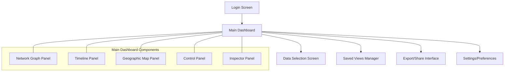
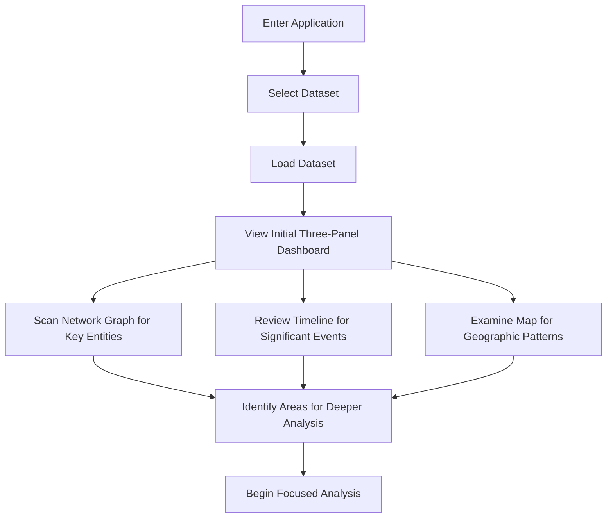
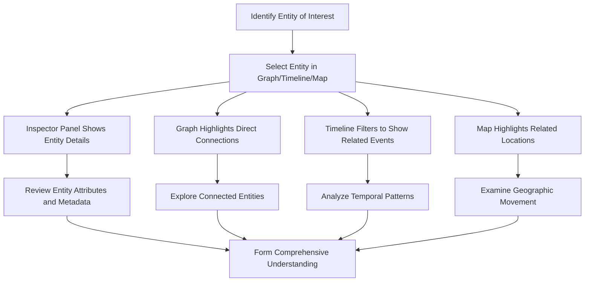
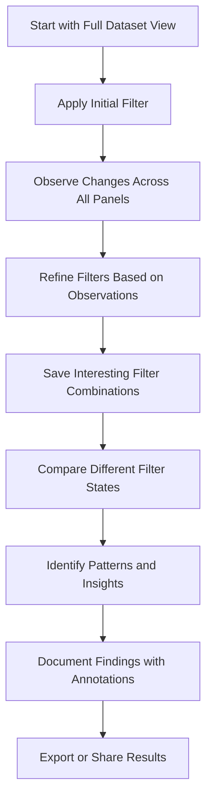

# Kindi Intelligence Analysis Platform
## UI/UX Specification

### Introduction

This document defines the user experience goals, information architecture, user flows, and visual design specifications for Kindi Intelligence Analysis Platform's user interface. It serves as the foundation for visual design and frontend development, ensuring a cohesive and user-centered experience.

#### Overall UX Goals & Principles

##### Target User Personas

**Intelligence Analyst (Primary)**: Professional analysts working with complex datasets to identify patterns and generate insights. They are detail-oriented, methodical, and need to make data-driven decisions quickly. They often work with large volumes of interconnected data and require tools that reduce cognitive load while maximizing analytical capabilities.

**Investigation Lead (Secondary)**: Subject matter experts coordinating team efforts and setting analysis priorities. They need high-level overviews with the ability to drill down into details when necessary. They often need to share findings and collaborate with team members.

**Field Operator (Tertiary)**: Users needing quick access to specific intelligence in operational contexts. They require focused views of relevant data with minimal interface complexity, often under time pressure.

##### Usability Goals

- **Efficiency**: Reduce time to insight by 50% compared to using separate tools
- **Cognitive load reduction**: Minimize mental effort required to connect information across different visualization paradigms
- **Learnability**: Allow new users to understand core interaction patterns within 10 minutes
- **Memorability**: Create consistent patterns that become intuitive after initial learning
- **Error prevention**: Provide clear visual feedback for all interactions and prevent data loss
- **Satisfaction**: Create a professional tool that analysts feel confident and comfortable using for extended periods

##### Design Principles

1. **Unified Perspective** - Present multiple data views as facets of the same information, not separate tools
2. **Context Preservation** - Never lose sight of the big picture when focusing on details
3. **Synchronized Interactions** - Actions in one view should have predictable, consistent effects across all views
4. **Progressive Disclosure** - Show only what's needed, when it's needed, to maintain focus
5. **Visual Hierarchy** - Use color, contrast, and positioning to guide attention to what matters most
6. **Direct Manipulation** - Enable users to interact directly with visualizations rather than through complex controls
7. **Persistent Mental Model** - Maintain consistent layout and interaction patterns to build spatial memory

#### Change Log

| Date | Version | Description | Author |
|------|---------|-------------|--------|
| 2023-06-16 | 0.1 | Initial UI/UX specification | UX Expert |

### Information Architecture (IA)

#### Site Map / Screen Inventory

#### Navigation Structure

**Primary Navigation:** The application uses a minimal top navigation bar containing:
- Application logo/name (left-aligned)
- Current dataset/operation name (center)
- Time range selector (dropdown)
- Entity filter (dropdown)
- Global search (right-aligned)
- User profile/settings menu (far right)

**Secondary Navigation:** Secondary navigation is context-based within each panel:
- Network Graph: View controls (expand, export)
- Timeline: View mode toggles (real-time, layers)
- Map: Base map toggles (satellite, streets)
- Control Panel: Filter categories and saved filter sets
- Inspector Panel: Tab navigation for different information types

**Breadcrumb Strategy:** The application maintains state through visual indicators rather than traditional breadcrumbs. The current selection state is always visible through highlighting across all visualization panels. History navigation is provided through browser back/forward buttons and an explicit history panel in the Control Panel.

### User Flows

#### Initial Data Exploration

**User Goal:** Load a dataset and gain an initial understanding of its contents and patterns

**Entry Points:** Login screen, Data selection screen

**Success Criteria:** User can identify key entities, events, and locations in the dataset

**Edge Cases & Error Handling:**
- Dataset too large: Provide sampling options or progressive loading
- No geographic data: Display message in map panel with suggestion to use other views
- No temporal data: Display message in timeline panel with suggestion to use other views
- Loading errors: Clear error messages with retry options

**Notes:** Initial load should prioritize showing an overview before loading full detail to provide immediate feedback. Consider using skeleton screens during loading.

#### Entity-Focused Analysis

**User Goal:** Investigate a specific entity and understand its connections, activities, and movements

**Entry Points:** Selecting an entity in any visualization panel, searching for an entity

**Success Criteria:** User can trace the entity's connections, timeline of activities, and geographic presence

**Edge Cases & Error Handling:**
- Entity with no connections: Display message in graph panel
- Entity with no events: Display message in timeline panel
- Entity with no locations: Display message in map panel
- Multiple entities with similar names: Provide disambiguation options

**Notes:** Selection state should be clearly visible across all panels. Consider using consistent color coding for the selected entity across all visualizations.

#### Pattern Recognition

**User Goal:** Identify patterns and relationships across multiple entities and events

**Entry Points:** Main dashboard after initial exploration

**Success Criteria:** User can apply filters to focus analysis and identify meaningful patterns

**Edge Cases & Error Handling:**
- No results match filter: Clear message with suggestions to broaden criteria
- Too many results: Suggest additional filters to narrow focus
- Filter conflicts: Warn when filters may cancel each other out
- Performance issues with complex filters: Provide feedback and optimization options

**Notes:** Filter history should be easily accessible to allow quick comparison between different states. Consider providing visual cues for significant changes when filters are applied.

### Wireframes & Mockups

#### Design Files

**Primary Design Files:** The detailed UI design is available in Figma at [Kindi Intelligence Platform Design](https://uxpilot.ai/s/066cabab83354d1d65ab2d86e100945b)

#### Key Screen Layouts

##### Main Dashboard

**Purpose:** Primary workspace for intelligence analysis, showing all visualization components simultaneously

**Key Elements:**
- Header with application controls and global search
- Three-panel visualization layout (Graph, Timeline, Map)
- Left sidebar Control Panel for filters and data management
- Right sidebar Inspector Panel for detailed information
- Resizable panels with drag handles

**Interaction Notes:** The layout should maintain consistent positioning while allowing users to resize panels based on their current focus. The Inspector Panel should slide in when an item is selected and can be collapsed when not needed. The Control Panel should be collapsible to maximize visualization space.

**Design File Reference:** See the attached screenshot for reference layout

##### Entity Inspector Panel

**Purpose:** Display detailed information about selected entities, events, or locations

**Key Elements:**
- Entity header with type indicator and risk level
- Tabbed interface for different information categories
- Metadata display with key-value pairs
- Related entities section with quick-select links
- Timeline of entity activities
- Action buttons for common tasks

**Interaction Notes:** The panel should update immediately when selection changes in any visualization. Content should adapt based on the type of selected item (entity, event, location). The panel should be scrollable for items with extensive information.

**Design File Reference:** See the attached screenshot for reference layout

### Component Library / Design System

#### Design System Approach

**Design System Approach:** The Kindi platform will use a custom design system built on Tailwind CSS, optimized for data visualization and intelligence analysis workflows. The system will prioritize clarity, consistency, and efficient information display. Components will follow a dark theme with high-contrast accents for data visualization.

#### Core Components

##### Navigation Bar

**Purpose:** Provide global navigation and context for the application

**Variants:** Standard (with all controls), Compact (minimal controls for smaller screens)

**States:** Default, Active section, Loading

**Usage Guidelines:** The navigation bar should always be visible and provide consistent access to global functions. It should display the current dataset/operation name and provide access to user settings and global search.

##### Panel Container

**Purpose:** Provide a consistent container for visualization panels and sidebars

**Variants:** Visualization Panel, Control Panel, Inspector Panel

**States:** Default, Active/Selected, Collapsed, Resizing

**Usage Guidelines:** Panel containers should have consistent styling with clear headers and borders. They should support resizing where appropriate and maintain minimum dimensions to ensure usability. Panels should include standard controls for expand/collapse, maximize, and export where applicable.

##### Data Visualization Controls

**Purpose:** Provide consistent controls for interacting with visualizations

**Variants:** Graph Controls, Timeline Controls, Map Controls

**States:** Default, Active, Disabled

**Usage Guidelines:** Visualization controls should be positioned consistently within each panel. Common functions (zoom, pan, select) should use consistent icons and behaviors across all visualization types. Controls should be grouped logically and use tooltips for clarity.

##### Filter Controls

**Purpose:** Enable users to filter data across all visualizations

**Variants:** Simple Filter, Range Filter, Complex Filter, Saved Filter

**States:** Default, Active, Disabled, Error

**Usage Guidelines:** Filters should provide immediate visual feedback when applied. They should be grouped by category in the Control Panel and support saving and combining. Active filters should be clearly indicated with options to quickly clear or modify them.

##### Search Component

**Purpose:** Enable global search across all data dimensions

**Variants:** Simple Search, Advanced Search

**States:** Default, Focused, Results, No Results, Error

**Usage Guidelines:** Search should be prominently positioned and support keyboard shortcuts. Results should be categorized by type (entity, event, location) and provide quick-select options. Recent searches should be accessible through search history.

### Branding & Style Guide

#### Visual Identity

**Brand Guidelines:** The Kindi platform uses a professional, authoritative visual identity appropriate for intelligence analysis work. The design emphasizes clarity, focus, and data visualization with minimal decoration.

#### Color Palette

| Color Type | Hex Code | Usage |
|------------|----------|-------|
| Primary | #1A1E23 | Background, containers |
| Secondary | #2A2F36 | Panels, cards, secondary elements |
| Accent | #3E7BFA | Primary buttons, selections, highlights |
| Success | #2ECC71 | Positive indicators, confirmations |
| Warning | #F39C12 | Cautions, warnings, attention required |
| Error | #E74C3C | Errors, critical alerts, destructive actions |
| Neutral | #8A9199, #C4C9D4, #E1E5EB | Text, borders, subtle UI elements |

#### Typography

##### Font Families
- **Primary:** Inter (UI text, labels, data)
- **Secondary:** Roboto (Headers, titles)
- **Monospace:** JetBrains Mono (Code, technical data)

##### Type Scale

| Element | Size | Weight | Line Height |
|---------|------|--------|------------|
| H1 | 24px | 600 | 1.2 |
| H2 | 20px | 600 | 1.25 |
| H3 | 16px | 600 | 1.3 |
| Body | 14px | 400 | 1.5 |
| Small | 12px | 400 | 1.4 |

#### Iconography

**Icon Library:** Custom icon set with supplemental icons from Phosphor Icons

**Usage Guidelines:** Icons should be used consistently throughout the interface to represent actions and object types. Entity type icons should be consistent across all visualizations. Icons should be simple, recognizable, and include tooltips for clarity.

#### Spacing & Layout

**Grid System:** 8px base grid with 16px standard spacing between major components

**Spacing Scale:** 4px, 8px, 16px, 24px, 32px, 48px, 64px

### Accessibility Requirements

#### Compliance Target

**Standard:** WCAG 2.1 AA

#### Key Requirements

**Visual:**
- Color contrast ratios: Minimum 4.5:1 for normal text, 3:1 for large text
- Focus indicators: Visible focus states for all interactive elements
- Text sizing: Support for browser text resizing up to 200%

**Interaction:**
- Keyboard navigation: All functions accessible via keyboard
- Screen reader support: Proper ARIA labels for visualization elements
- Touch targets: Minimum 44x44px for all interactive elements

**Content:**
- Alternative text: Text alternatives for all non-text content
- Heading structure: Logical heading hierarchy
- Form labels: All form controls have associated labels

#### Testing Strategy

Accessibility testing will include automated testing with axe DevTools, keyboard navigation testing, screen reader testing with NVDA and VoiceOver, and contrast checking with the WebAIM Contrast Checker. Testing will be performed throughout development with a comprehensive audit before release.

### Responsiveness Strategy

#### Breakpoints

| Breakpoint | Min Width | Max Width | Target Devices |
|------------|-----------|-----------|---------------|
| Mobile | 320px | 767px | Smartphones |
| Tablet | 768px | 1023px | Tablets, small laptops |
| Desktop | 1024px | 1439px | Laptops, desktop monitors |
| Wide | 1440px | - | Large monitors, ultrawide displays |

#### Adaptation Patterns

**Layout Changes:** On smaller screens, the three-panel layout will stack vertically with the ability to maximize individual panels. The Control Panel and Inspector Panel will become overlays rather than persistent sidebars.

**Navigation Changes:** On mobile devices, the navigation bar will collapse to essential elements with a menu button for additional options. Secondary panel controls will be accessible through a more menu.

**Content Priority:** Visualization panels will maintain minimum useful dimensions with the option to view one panel at full screen. The most relevant visualization for the current selection will be prioritized.

**Interaction Changes:** Touch interactions will be optimized for mobile devices with larger touch targets and swipe gestures for panel navigation.

### Animation & Micro-interactions

#### Motion Principles

The Kindi platform uses subtle, purposeful animations that enhance understanding without distraction. Animations should provide feedback, show relationships, and guide attention. All animations should be brief (200-300ms) with appropriate easing and respect user preferences for reduced motion.

#### Key Animations

- **Selection Highlight:** When an item is selected, it highlights immediately while related items in other panels highlight with a brief fade-in (Duration: 200ms, Easing: ease-out)
- **Panel Resize:** Smooth animation when panels are resized (Duration: 150ms, Easing: ease-in-out)
- **Inspector Panel Reveal:** Slide-in animation when the Inspector Panel appears (Duration: 250ms, Easing: ease-out)
- **Filter Application:** Subtle fade/transition when filters are applied to visualizations (Duration: 300ms, Easing: ease-in-out)
- **Hover States:** Immediate feedback on hover with subtle scaling or brightness change (Duration: 100ms, Easing: ease-out)

### Performance Considerations

#### Performance Goals

- **Page Load:** Initial interactive dashboard visible within 2 seconds
- **Interaction Response:** UI responses within 100ms of user action
- **Animation FPS:** Maintain 60fps for all animations

#### Design Strategies

Performance is a critical consideration for the Kindi platform, especially when working with large datasets. The design incorporates several strategies to maintain responsiveness:

1. Progressive loading of visualization data, showing overview first
2. Virtualization for large lists and graph components
3. Efficient rendering through canvas-based visualizations
4. Optimized asset loading with proper caching
5. Throttling and debouncing for continuous interactions like panning and zooming
6. Precomputed data transformations for common filter operations
7. Lazy loading of non-critical components and data

### Next Steps

#### Immediate Actions

1. Review UI/UX specification with development team
2. Finalize component design in Figma
3. Create interactive prototype for user testing
4. Develop component library based on design system
5. Implement core layout and navigation structure

#### Design Handoff Checklist

- [x] All user flows documented
- [x] Component inventory complete
- [x] Accessibility requirements defined
- [x] Responsive strategy clear
- [x] Brand guidelines incorporated
- [x] Performance goals established

### Checklist Results

The UI/UX specification has been reviewed against best practices for intelligence analysis applications and meets the requirements outlined in the PRD. The design prioritizes clarity, efficiency, and synchronized interactions while maintaining a professional aesthetic appropriate for the target users.
