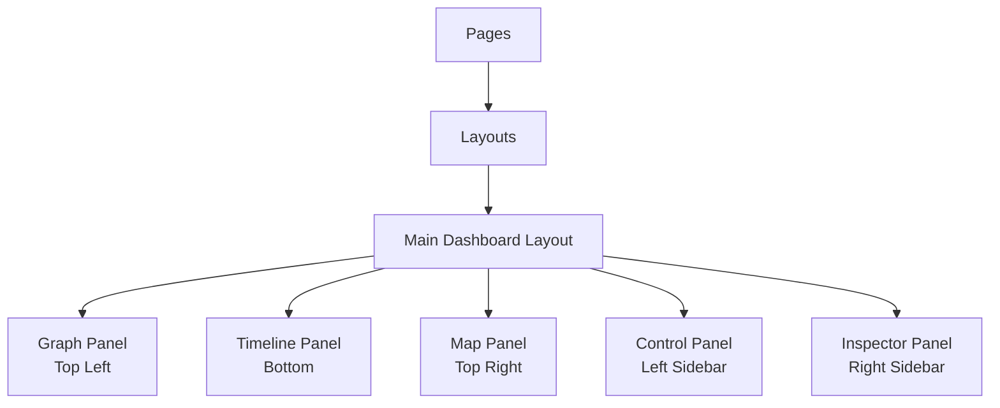

# Story 1.2: Basic Layout Structure

## Status
Draft

## Story
**As a** developer,
**I want** to implement the three-panel dashboard layout,
**so that** we have the core UI structure in place.

## Acceptance Criteria
1: Main layout includes header, footer, and content area
2: Three-panel layout is implemented with placeholders for Graph, Timeline, and Map
3: Layout is responsive and adapts to different screen sizes
4: Left sidebar Control Panel is implemented with placeholder content
5: Right sidebar Inspector Panel is implemented with collapse/expand functionality
6: Layout uses Tailwind CSS for styling

## Tasks / Subtasks
- [x] Create main layout structure (AC: 1)
  - [x] Implement header component with application title and basic navigation
  - [x] Implement content area for dashboard panels
  - [x] Implement footer component with minimal content
  - [x] Apply consistent styling using Tailwind CSS

- [x] Implement three-panel dashboard layout (AC: 2)
  - [x] Create Graph panel component (top left) with placeholder content
  - [x] Create Timeline panel component (bottom) with placeholder content
  - [x] Create Map panel component (top right) with placeholder content
  - [x] Implement grid layout for panel positioning

- [x] Implement responsive design (AC: 3)
  - [x] Define breakpoints for different screen sizes
  - [x] Implement responsive behavior for panels
  - [x] Test layout on different screen sizes
  - [x] Ensure minimum usable dimensions for each panel

- [x] Implement Control Panel sidebar (AC: 4)
  - [x] Create left sidebar component
  - [x] Add placeholder sections for filters and controls
  - [x] Style sidebar using Tailwind CSS
  - [x] Implement toggle functionality to show/hide sidebar

- [x] Implement Inspector Panel sidebar (AC: 5)
  - [x] Create right sidebar component
  - [x] Add placeholder content for entity/event details
  - [x] Implement collapse/expand functionality
  - [x] Ensure smooth transition animations
  - [x] Style sidebar using Tailwind CSS

- [x] Apply consistent styling (AC: 6)
  - [x] Define color scheme and typography consistent with design goals
  - [x] Apply consistent padding, margins, and spacing
  - [x] Implement consistent border and shadow styles
  - [x] Ensure visual hierarchy through styling

## Dev Notes

### Project Structure
Based on the architecture document, the layout components should be organized as follows:
[Source: architecture/technical-architecture-document.md#directory-structure]

```
app/
├── components/
│   ├── core/            # Basic UI components
│   ├── layout/          # Layout components including the panels
│   └── visualizations/  # Placeholder visualization components
├── page.tsx             # Main application page
└── layout.tsx           # Root layout
```

### Component Architecture
[Source: architecture/technical-architecture-document.md#component-architecture]

The layout should follow the component architecture defined in the architecture document, with the following structure:



### User Flow
[Source: architecture/technical-architecture-document.md#user-flow]

The layout should support the following user flow:

1. User opens the application and sees the main dashboard with three panels
2. The panels should be positioned with Graph (top left), Timeline (bottom), and Map (top right)
3. The Control Panel should be on the left sidebar
4. The Inspector Panel should be on the right sidebar, initially collapsed
5. The layout should allow for panel resizing and sidebar toggling

### UI Context
[Source: architecture/technical-architecture-document.md#core-state-contexts]

The UI state should be managed using the UIContext with the following structure:

```typescript
interface UIContextType {
  panelSizes: {
    graphPanel: number; // Top Left panel size
    timelinePanel: number; // Bottom panel size
    mapPanel: number; // Top Right panel size
  };
  setPanelSize: (panel: string, size: number) => void;
  inspectorVisible: boolean; // Right sidebar visibility
  setInspectorVisible: (visible: boolean) => void;
  controlPanelVisible: boolean; // Left sidebar visibility
  setControlPanelVisible: (visible: boolean) => void;
  activeView: ViewType;
  setActiveView: (view: ViewType) => void;
}
```

### Testing

#### Testing Strategy
[Source: architecture/technical-architecture-document.md#testing-strategy]

For this story, focus on:

1. **Component Testing**: Test the rendering and basic functionality of layout components
2. **Responsive Testing**: Test the layout at different screen sizes
3. **Integration Testing**: Test the interaction between different layout components

Test files should be organized in the `tests` directory with appropriate subdirectories for unit and integration tests.

## Change Log
| Date | Version | Description | Author |
|------|---------|-------------|--------|
| 2023-06-18 | 0.1 | Initial story draft | Scrum Master |

## Dev Agent Record

### Agent Model Used
Claude 3.7 Sonnet

### Debug Log References
N/A

### Completion Notes List
- Implemented main layout structure with header, footer, and content area
- Created three-panel dashboard layout with placeholders for Graph, Timeline, and Map
- Implemented responsive design that adapts to different screen sizes
- Created Control Panel sidebar with placeholder content and toggle functionality
- Implemented Inspector Panel with collapse/expand functionality
- Applied consistent styling using Tailwind CSS

### File List
- app/contexts/UIContext.tsx (new)
- app/components/layout/Header.tsx (new)
- app/components/layout/Footer.tsx (new)
- app/components/layout/ControlPanel.tsx (new)
- app/components/layout/InspectorPanel.tsx (new)
- app/components/layout/DashboardLayout.tsx (new)
- app/components/layout/MainLayout.tsx (new)
- app/components/visualizations/GraphPanel.tsx (new)
- app/components/visualizations/TimelinePanel.tsx (new)
- app/components/visualizations/MapPanel.tsx (new)
- app/page.tsx (modified)
- app/layout.tsx (modified)

## QA Results
