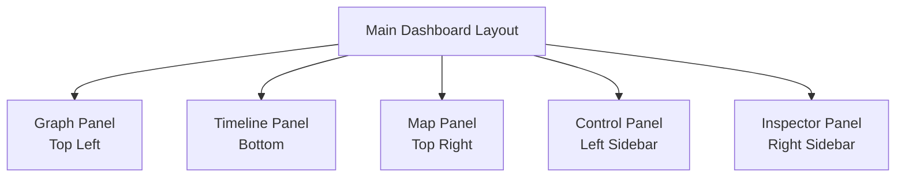

# Story 1.4: Responsive Container Components

## Status
Draft

## Story
**As an** analyst,
**I want** the visualization panels to resize appropriately,
**so that** I can adjust the view based on my analysis needs.

## Acceptance Criteria
1: Panels can be resized by dragging dividers between them
2: Panel size constraints prevent panels from becoming too small
3: Panel size preferences are remembered within a session
4: Responsive design adapts to different screen sizes
5: Panels maintain proper aspect ratios when resized
6: Mobile view provides alternative layout for smaller screens

## Tasks / Subtasks
- [x] Implement resizable panel components (AC: 1)
  - [x] Create ResizablePanel component with drag handles
  - [x] Implement drag functionality for horizontal and vertical resizing
  - [x] Add event listeners for drag start, drag, and drag end
  - [x] Ensure smooth resizing with visual feedback

- [x] Implement size constraints (AC: 2)
  - [x] Define minimum and maximum sizes for each panel type
  - [x] Add constraint logic to prevent panels from becoming too small
  - [x] Implement collision detection between adjacent panels
  - [x] Add visual indicators when size constraints are reached

- [x] Implement session persistence (AC: 3)
  - [x] Create panel size state management in UIContext
  - [x] Store panel size preferences in session storage
  - [x] Restore panel sizes on page reload
  - [x] Add reset functionality to return to default sizes

- [x] Implement responsive design (AC: 4)
  - [x] Define breakpoints for different screen sizes
  - [x] Create responsive layout adjustments for each breakpoint
  - [x] Test layout on various screen dimensions
  - [x] Ensure usability across different devices

- [x] Implement aspect ratio maintenance (AC: 5)
  - [x] Add logic to maintain appropriate aspect ratios during resizing
  - [x] Implement proportional resizing for related panels
  - [x] Ensure visualization components adapt to container size changes
  - [x] Test resizing with different content types

- [x] Implement mobile view (AC: 6)
  - [x] Create alternative layout for small screens
  - [x] Implement panel stacking for mobile devices
  - [x] Add swipe gestures for panel navigation on touch devices
  - [x] Ensure all functionality remains accessible on small screens

## Dev Notes

### Panel Layout Structure
[Source: architecture/technical-architecture-document.md#component-architecture]

The panel layout should follow this structure:



### UI Context for Panel Sizing
[Source: architecture/technical-architecture-document.md#core-state-contexts]

Use the UIContext to manage panel sizes:

```typescript
interface UIContextType {
  panelSizes: {
    graphPanel: number; // Top Left panel size
    timelinePanel: number; // Bottom panel size
    mapPanel: number; // Top Right panel size
  };
  setPanelSize: (panel: string, size: number) => void;
  inspectorVisible: boolean; // Right sidebar visibility
  setInspectorVisible: (visible: boolean) => void;
  controlPanelVisible: boolean; // Left sidebar visibility
  setControlPanelVisible: (visible: boolean) => void;
  activeView: ViewType;
  setActiveView: (view: ViewType) => void;
}
```

### Custom Hooks
[Source: architecture/technical-architecture-document.md#custom-hooks]

Implement a custom hook for panel resizing:

```typescript
// useResizePanel: Handle panel resizing with drag interactions
const useResizePanel = (
  panelId: string,
  initialSize: number,
  minSize: number,
  maxSize: number
) => {
  // Implementation details
};
```

### Responsive Design Breakpoints
[Source: architecture/technical-architecture-document.md#directory-structure]

Define breakpoints in the Tailwind configuration:

```javascript
// tailwind.config.js
module.exports = {
  theme: {
    screens: {
      'sm': '640px',
      'md': '768px',
      'lg': '1024px',
      'xl': '1280px',
      '2xl': '1536px',
    },
  },
};
```

### Mobile Layout Considerations
For mobile devices (screens smaller than 768px):
- Stack panels vertically instead of using the three-panel layout
- Make panels full-width
- Allow swiping between panels
- Hide sidebars by default with a toggle button to show them

### Testing

#### Testing Strategy
[Source: architecture/technical-architecture-document.md#testing-strategy]

For this story, focus on:

1. **Component Testing**: Test the resizable panel components
2. **Integration Testing**: Test the interaction between panels during resizing
3. **Responsive Testing**: Test the layout at different screen sizes
4. **Browser Compatibility**: Test across different browsers and devices

Test files should be organized in the `tests` directory with appropriate subdirectories for unit and integration tests.

## Change Log
| Date | Version | Description | Author |
|------|---------|-------------|--------|
| 2023-06-18 | 0.1 | Initial story draft | Scrum Master |

## Dev Agent Record

### Agent Model Used
Claude 3.7 Sonnet

### Debug Log References
N/A

### Completion Notes List
- Created custom useResizePanel hook for panel resizing functionality
- Implemented ResizablePanel component with drag handles
- Added size constraints to prevent panels from becoming too small
- Implemented session persistence for panel sizes using sessionStorage
- Created responsive design that adapts to different screen sizes
- Implemented mobile view with stacked panels for small screens
- Added visual indicators for resize handles

### File List
- app/hooks/useResizePanel.ts (new)
- app/components/core/ResizablePanel.tsx (new)
- app/components/core/resizable.css (new)
- app/components/layout/DashboardLayout.tsx (modified)

## QA Results
